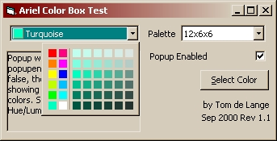

<div align="center">

## Ariel Color Box Control V1\.1 \(updated\)


</div>

### Description

A popup color selector active-x control, similar to a combobox, featuring 12 different palettes, and 2 color selection events: Click() and Change(). The popup window can be disabled, in which case the popup()event may be used to substitute your own color selection code, or access to the common windows dialog. Hue selection is done

through mouse hovering using custom timer class. Credits to various PSC contributors as listed in the text file. Uses 12 API functions. Full source included - well commented.

V1.1 now includes hWnd property. (Thanks Ross McCawley!)
 
### More Info
 


<span>             |<span>
---                |---
**Submitted On**   |2000-10-03 21:19:46
**By**             |[Tom de Lange](https://github.com/Planet-Source-Code/PSCIndex/blob/master/ByAuthor/tom-de-lange.md)
**Level**          |Intermediate
**User Rating**    |5.0 (45 globes from 9 users)
**Compatibility**  |VB 4\.0 \(32\-bit\), VB 5\.0, VB 6\.0
**Category**       |[Custom Controls/ Forms/  Menus](https://github.com/Planet-Source-Code/PSCIndex/blob/master/ByCategory/custom-controls-forms-menus__1-4.md)
**World**          |[Visual Basic](https://github.com/Planet-Source-Code/PSCIndex/blob/master/ByWorld/visual-basic.md)
**Archive File**   |[CODE\_UPLOAD104031032000\.zip](https://github.com/Planet-Source-Code/tom-de-lange-ariel-color-box-control-v1-1-updated__1-11576/archive/master.zip)

### API Declarations

```
No need to copy!
---------------------------------
MoveToEx Lib "gdi32"
LineTo Lib "gdi32"
DrawEdge Lib "user32"
PtInRect Lib "user32"
SetParent Lib "user32"
SetWindowLong Lib "user32"
SetCapture Lib "user32"
GetCapture Lib "user32"
ReleaseCapture Lib "user32"
GetWindowRect Lib "user32"
GetClientRect Lib "user32"
GetFocus Lib "user32"
```


